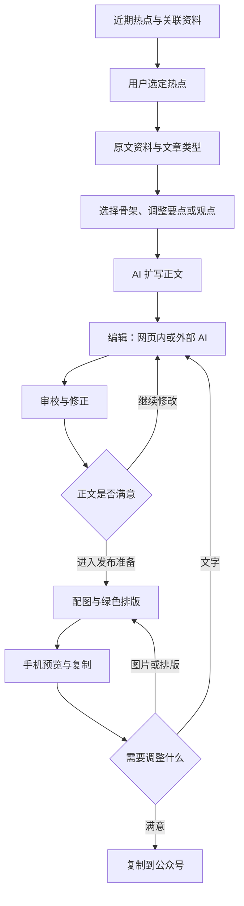

# Writter 开发与跨对话接续指南

更新时间：2026-10-06（Asia/Shanghai）。本指南是项目接续入口，整理用户已确认的方向、仓库现状、研究参考与下一步任务。目标设计不代表已实现。后续用户明确指示优先于本文件，变更后应同步更新。

## 1. 新对话或新软件从这里开始

仓库：https://github.com/AsteriaAnna/writter

接手时先读本指南，说明当前分支、代码和部署状态；按具体任务阅读相关文件，不必先做全仓库重新审计。先辨认“已实现”“PR 待合并”“待设计”“真实验收待完成”，再行动。用户在本轮要求讨论设计与保存指南，没有要求继续修改功能代码或部署。

本次核对的 main 基线：`88748a3bcd0dae984122a79bdf5f36d1c4e243b5`。这是指南提交前的代码基线，后续提交会推进 main，不应把本编号当成永远最新的 HEAD。

PR #2：https://github.com/AsteriaAnna/writter/pull/2

- 核对时为 open、未合并，分支 `fix/editorial-quality`，提交 `322147ace1d2bccb01b266db35b75d9d67e0d006`。
- 该 PR 增加问题/论点/段落承接的策划约束，分别复查事实、结构、文字，支持自然语言修改正文。
- 37 项测试、检查与构建通过；未部署，未验证新版真实模型成品。
- 它是部分写作质量修复，不等于完整实现骨架选择、个人风格、局部编辑、配图与最终排版。是否采用其中设计，需要结合本指南重新判断。

以后接手时快速核对这些状态即可，不假定仍然未合并，也不自动合并 PR。

## 2. 产品目的与已确定边界

Writter 帮用户从 AI 热点与资讯中挑选题材，组织成适合自己公众号的文章，再编辑、配图、排版和复制。能出文字和流程可运行不是质量通过：成品要清楚、具体、结构合理，并符合文章类型与用户意图。

用户先前确认的逻辑流程是：选择热点 → 检测 → 策划 → 调整 → 确认 → 生成 → 排版 → 预览。来源与内容审校服务于这个流程，不要求每个内部步骤成为独立页面或人工批准门。

当前 UI 仅作参考，页面、模块划分与基础结构没有整体冻结。开发先保证底层逻辑合理，再完善交互和视觉，不以旧页面限制新产品设计。

“网页、工作流、固定 AI 工作”是不同层次，不必三选一：

- 网页承担热点浏览、结构选择、编辑与发布预览。
- 后台工作流承担资料读取、策划、生成、审校和持久化。
- 可复用的写作规则承载骨架、语言习惯与编辑要求，可用于网页内模型或外部 AI。
- 程序承担采集、保存、版本、确定性排版；不把所有步骤都交给模型。

这是建议的实施方向，不是已选定的 Agent 框架或新的技术栈。不要因为术语而引入额外平台、复杂自主 Agent 或全套知识图谱。

## 3. 2026-10-06 20:40 用户新增明确决定

### 3.1 资讯获取优先研究已有上游

最初方向是利用已有的公开/开源资讯网站，不从零建设全网爬虫。下一项重点是弄清上游网站怎样读取：官方文档或源码、API/RSS/公开 JSON 入口、真实字段、内容完整度、原文和讨论跳转、更新方式、读取限制，然后再决定 Writter 的展示。

此前 AIHOT 是主要候选入口，AI News Aggregator 是补充；实际上代码目前只实现后者。不要把“有聚合网站页面”写成“已接入该网站 API”。也不要把 URL 字段默认视为原始发布者链接，需核对真实样本。

### 3.2 筛选由用户决定

系统展示最近热点、摘要和资料；用户按自己的兴趣决定哪些值得写。暂不建设“AI 替用户判定值得写”的筛选评分机制，不要求用户服从 AI 选题建议。可提供信息辅助，但不能据评分隐藏或替用户排除题材。

用户可选一个或多个热点。进入后续步骤时针对某个热点操作；默认各自成为独立文章任务，不自动合成一篇。多热点合写需用户明确表达。

### 3.3 区分热点事件、骨架、个人风格与每篇观点

用户消息中的“股价”按上下文理解为“骨架”。

- 热点/资料：发生了什么，原文在哪里，哪些信息有依据。
- 骨架：文章怎样组织，如总—分—总、分—总、先三个要点再收束。
- 个人风格：跨文章的语言与表达习惯，需通过样稿或用户反馈逐步确定，不能凭空指定。
- 每篇观点：这篇文章想表达的判断，不等同于骨架，也不能自动当成用户的立场。

事件介绍类应把事情、有意思的点、相关背景讲清楚，不强制创造“硬观点”；解释、比较可以是中心。AI 学习方式/方法类更需要讨论并确定论点。文章类型可以建议，用户能修改；不强迫填写观点表格才能生成。

### 3.4 用户希望的协作过程

1. 系统展示近期热点，用户选择一个或多个。
2. 打开某热点，看到原始资料链接，知道去哪里了解知识。
3. 系统给出骨架及其中的基本要点/观点；用户可以改论点、改内容、换骨架。
4. 确定后 AI 扩写，让结构成为有具体信息和阅读价值的正文。
5. 用户修改文字、措辞、准确性，必要时反复与 AI 交互。
6. 进入配图与排版；用户检查结果，调整图片、位置、样式或文字细节。
7. 复制粘贴到微信公众号，由用户完成后续发布操作。当前不需要自动发布 API。

### 3.5 多轮交互和外部 AI 都可用

用户认为一次提示不足以调好文章，可能需要自然语言多轮修改。网页内对话是可讨论方案，尚未定为必须实现的完整聊天产品。

用户也接受将文字工作交给其他软件，通过复制粘贴往返完成，避免网页持续增负。应先讨论轻量往返机制：导出原始链接/必要摘录、所选骨架、当前正文及修改要求；回来粘贴新稿，保留原版本并让审校与预览过期。无需先做第三方登录、自动发送、跨软件同步或庞大聊天历史系统。

### 3.6 骨架与风格研究是后续任务

用户要求之后查找国内高关注/爆款文章，拆解骨架和经典表达结构。此次只记录任务，尚未开展样本研究。必须记录来源、题材及热度证据；无法验证热度时不能称“爆款”。区分热点报道、解释分析、方法指南等类别，避免把同一种观点模板套给全部文章。骨架参考不等于仿写原文措辞，也不等于已经确定用户个人风格。

## 4. 目标框架与页面层级（用户认可的讨论稿）



| 一级工作区 | 内部区域 | 用户任务 |
| --- | --- | --- |
| 发现选题 | 资讯列表、事件详情、关联资料 | 看信息，选定热点 |
| 写作工作台 | 骨架/要点、正文、资料/审校侧栏 | 确定怎么讲，生成与修改 |
| 发布准备 | 配图、绿色排版、手机预览与复制 | 调整并检查最终效果 |

内部区域不必各做一个页面。一篇文章贯穿工作区，返回时保留内容、设置和当前位置。系统状态表达“正在处理”“已完成”“需要用户做某个具体选择”，不增加笼统“等待查看”。

## 5. 当前代码和实际能力

| 部分 | 代码位置 | 现状与边界 |
| --- | --- | --- |
| 热点读取 | `src/feed.js`、`src/domain.js` | 读取 AI News Aggregator 公开 JSON，24h/7d，5 分钟进程内缓存；AIHOT 仍为 pending |
| 页面交互 | `public/app.js` | 热点池、编辑策划、工作室、纯复制视图；不是完整目标交互 |
| 原文读取 | `src/source-reader.js` | 原始 URL 加最多 4 个补充 URL；有超时和网络地址约束；部分 JS 渲染页面取不到正文，无完整全网搜索 |
| 模型调用 | `src/ai.js` | JSON 输出、引文定位、生成与审校；定位不等于语义支持，不保证文章质量 |
| 任务和版本 | `src/workflow.js`、`src/cloud-api.js` | 确认快照、任务状态、版本保护、下游过期；当前由浏览器触发执行，不能写成已有独立后台队列 |
| 数据保存 | `src/pg-repo.js`、云函数入口 | CloudBase 登录与 PostgreSQL 项目保存；本轮没有授权改变鉴权方案或数据库结构 |
| 排版 | `src/domain.js` | 确定性基础 HTML 模板，非精确 V25，无实际生图 |
| 构建 | `scripts/build.mjs` | hosting 云端配置及云函数构建 |

当前上游读取入口（来自 `src/feed.js`，不是独立动态 API 的声明）：

```text
https://raw.githubusercontent.com/SuYxh/ai-news-aggregator/main/data/latest-24h.json
https://raw.githubusercontent.com/SuYxh/ai-news-aggregator/main/data/latest-7d.json
备用： https://cdn.jsdelivr.net/gh/SuYxh/ai-news-aggregator@main/data/latest-{24h或7d}.json
```

现有适配读取顶层 `items`、`generated_at`；条目使用 `id`、`title_zh/title`、`summary`、`url`、`source/site_name`、`published_at/first_seen_at`、`site_id`。适配结果包含 provider、externalId、title、summary、originalUrl、sourceName、publishedAt、category。**这只是代码当前消费的字段，不是已经完成的上游 API 契约研究；目前没有可靠热度字段的接入结论。**

下一步须核对样本里的 `url` 指向原文还是中间聚合页，摘要是上游生成还是原文摘录，时间的含义和格式，以及是否存在被当前适配丢掉的字段。

### 验收记录应怎样理解

main 的记录：32 项测试通过，历史真实模型/接口流程曾跑通；无头交互是 happy-dom 加模拟云调用，不是浏览器视觉验收。PR #2 是 37 项测试。不能混写两个分支的结果。

旧正文存在主线超出证据、把目标表述扩大为成果、并列材料缺少推进；旧审校返回零问题。因此旧报告“内容质量基本通过”的结论需要重新评价。

工具访问域名受限，只能说明工具不可访问；真实浏览器 Failed to fetch 的根因未完全确定，不能直接认定非代码问题。

## 6. 模型、部署与环境

环境：Writter，上海 `ap-shanghai`；不要与星账 `xingzhang-dev` 项目混用。

- 站点：https://writter-dev-d0g7h1prq4ce60665-1428502724.tcloudbaseapp.com/
- 环境：`writter-dev-d0g7h1prq4ce60665`
- 云函数：`writter-api`，Nodejs18.15；历史记录 timeout 180 秒。
- PostgreSQL：`postgres-k8lowqlc` / `public`。
- 密钥 `WRITTER_AI_KEY` 仅在云端，不写入仓库、前端、聊天或验收产物。
- 模型由 `WRITTER_AI_MODEL` 优先指定；main 代码默认 `deepseek-v4-pro`，最近部署记录云端变量为 `deepseek-flash`。记录可能变化，需要部署时核对实际值，不能只看默认值断言当前模型。
- `tcb fn deploy --force` 曾覆盖云端环境变量并清掉密钥。优先仅更新代码，避免按仓库配置覆盖环境；如必须全量部署，需按既有部署文档安全恢复配置。

本指南提交不部署、不改环境变量、不删除测试项目。真实模型成品尚待在可访问云端的环境验证。模型比较应使用相同资料、骨架、要求和修改任务，比较实际正文，不以合法 JSON 或模型自评作质量结论。

## 7. 外部参考与研究结论

以下根据官方文档/仓库说明整理，未实际运行这些参考项目，不作可用性或质量背书。

| 参考 | 借鉴内容 | 适用边界 |
| --- | --- | --- |
| [Cody Article Writer](https://github.com/ibuildwith-ai/cody-article-writer) | 研究、风格指南、论点、大纲、编辑和导出分开组织 | 可参考交互与规则组织；README 写明自定义许可限制软件修改/再分发，不默认复制其代码或提示词 |
| [Synthetix](https://github.com/WalkCloud/Synthetix) | 可编辑大纲、分节上下文、来源、版本、相同上下文模型比较 | 参考机制，暂不搬整套 RAG/知识图谱架构 |
| [Novel](https://github.com/steven-tey/novel) | Tiptap 所见即所得编辑与 AI 补全 | 参考正文编辑体验，不代表已决定迁移技术栈 |
| [FeedOverflow](https://github.com/roy2100/feedoverflow) | 资讯阅读、全文提取、RSSHub、网页和 AI 共用接口 | 参考数据与操作复用，不代表替换现有上游 |
| [RSSHub](https://github.com/DIYgod/RSSHub) | 扩展 RSS 来源 | 后续逐条确认实际所需路由、可访问性与部署成本 |

工程指南：

- [Anthropic: Building effective agents](https://www.anthropic.com/engineering/building-effective-agents)：区分受控工作流与自主 Agent，从简单可组合方案开始。对 Writter 的应用是推论，不是该指南对本项目的评价。
- [Google: Beyond vibe coding for the web](https://codelabs.developers.google.com/codelabs/beyond-vibe-coding-for-the-web)：产品需求 → 浏览器原型 → 技术规格 → 实现与真实使用验证。测试不能替代实际浏览器使用。
- [Google: Modern Web Guidance 101](https://codelabs.developers.google.com/codelabs/modern-web-guidance-101?hl=en)：明确浏览器兼容目标、遵循现代 Web 标准。这里的 Web Coding 指 AI 辅助网页开发，不是特定框架。

## 8. 接下来的讨论与开发顺序

### 第一项：现有上游数据接入研究（先读，不先改）

交付一份小范围、可验证的接入说明：

1. 确认 AIHOT 的准确网站/仓库身份，记录文档、源码、API/RSS/JSON 入口；无文档时如实区分观察与推断。
2. 分析 AI News Aggregator 已使用 JSON，保留少量脱敏真实样本；列字段、类型、空值、时间、语言、原文/讨论 URL 与热度证据。
3. 区分网站页面接口、稳定公开入口和需要鉴权的接口，确认读取完整度与故障表现。
4. 给出“上游字段 → 选题卡/事件详情”的映射，包括无法展示或需要补充的内容。首版不增加 AI 值得写评分。
5. 再决定如何适配代码、是否追加来源，不先建自己的广域爬虫。

### 第二项：骨架样本研究与写作方式

之后研究国内高关注文章，按事件报道/解释分析/方法指南拆解结构，验证热度证据和题材差异；共同确定少量首版骨架。个人风格需样稿/反馈，不冒充已经学会。

### 第三项：写作交互与外部往返

用真实热点演示“看原文 → 选骨架/改要点 → 扩写 → 再编辑”。比较轻量网页对话与复制到外部 AI 的方案，先决定需要哪些最小动作，再决定编辑器、对话记录和 API 设计。支持外部软件不等于必须增加直接集成。

### 第四项：原型、机制和实现

先做可点击原型验证顺手程度，再形成技术规格，明确资料包、骨架、文章类型、写作偏好、正文版本、修改范围及任务状态。按完整用户场景逐步实现，每轮同时看交互和成品，不反复扩大同类模拟测试。

### 第五项：配图、绿色排版与发布准备

用户认可的方向：绿色系、米色背景、克制留白、内缩卡片、少量清晰强调，避免满宽堆叠组件和莫名横线。最终效果看真实手机及粘贴公众号后的表现；具体 V25 尚待参考材料核对，不把当前基础 HTML 当最终模板。配图要有实际图片、位置与替换操作，配图建议不算生图完成。

## 9. 如何保持接续而不增加负担

- 重大决定在本指南更新：写明日期、用户决定、影响与待办；把建议和已确认事项分开。
- 每轮代码交付记录分支/提交或 PR、实际变更、验证类型、部署状态、下一项具体工作。
- 长篇实测结果放专项文档，本指南链接入口并保持状态摘要；不复制全量日志。
- README 和根目录 AGENTS.md 提供入口，跨软件接手先读本指南。
- 不因换对话而重新全量审计，不因旧文档写了“通过”而跳过对实际成品的判断。

### 本轮记录

2026-10-06：用户认可总体模型图，明确人工选题、上游接口优先研究、文章类型差异、骨架可编辑、多轮修改可内置或外包、编辑后配图排版并复制。此次只保存指南和入口，不修改功能、合并 PR 或部署。
